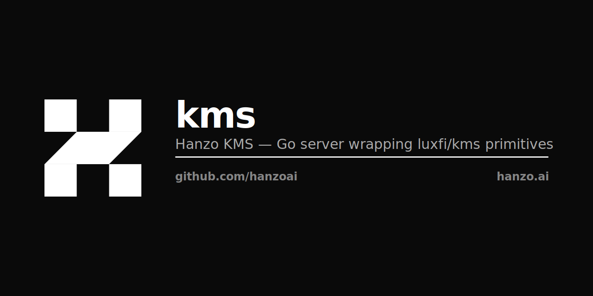

<p align="center"></p>

# Hanzo KMS

Secrets, keys, and threshold signing for the Hanzo platform — per-org namespaces, IAM-gated, ZAP-native, MPC-backed. A thin Go server over the canonical [`luxfi/kms`](https://github.com/luxfi/kms) primitives.

[]()
[](LICENSE)
[]()

## What this is

Hanzo KMS is the canonical secret store and signing service for every Hanzo deployment. It holds the per-tenant DEKs that back Hanzo Base, the provider API keys the AI and gateway services consume, certificate material, and validator signing keys.

AI agents are first-class identities: every secret carries a policy that controls whether an agent may read it — `auto-approve`, `requires-approval`, or `blocked` — with a full per-agent audit trail.

All server logic lives in `luxfi/kms`. This module wires those primitives with Hanzo defaults (IAM at `hanzo.id`, encrypted-at-rest storage, S3 replication) and adds JWT verification, the audit ledger, version CAS, and header hygiene. It mounts into the unified cloud binary (`kms.Mount`) and also ships as a standalone daemon.

## Quick start

Build from source — pure Go, no database toolchain required:

```bash
make kmsd kms          # builds ./kmsd (daemon) and ./kms (admin CLI)
KMS_ENV=dev ./kmsd     # HTTP on :8443, ZAP on :9999
```

Or run the container image (pin a released tag — never `:latest`):

```bash
docker run -p 8443:8443 ghcr.io/hanzoai/kms:vX.Y.Z
```

In any non-dev environment the daemon refuses to boot without full JWT config (`KMS_EXPECTED_ISSUER`, `KMS_EXPECTED_AUDIENCE`, `KMS_JWKS_URL`) — fail-closed by design.

## AI access control

Your secrets, your rules. AI agents are first-class citizens — and so is your ability to block them.

- **Per-secret policies** — mark any secret `requires-approval`; a read from any agent triggers a real-time approval prompt.
- **Auto-approve mode** — move fast in development, escalate specific secrets to manual sign-off before production.
- **Identity tracking** — see exactly which model, tool, or agent accessed which secret, and when.
- **Full audit trail** — every AI-originated read is logged with agent identity, timestamp, and reason.

```
Secret: STRIPE_LIVE_KEY
  policy:  requires-approval
  reader:  agent via hanzo-mcp
  status:  waiting for approval → [approve] [deny]
```

## API surface

Everything is served under `/v1/kms` — one canonical path per operation, no aliases, no `/api/`. Every endpoint requires a Hanzo IAM JWT (RS/ES/PS/EdDSA — never HS\*, never `none`) or an explicit admin role.

| Group | Endpoints |
|-------|-----------|
| Auth | `POST /v1/kms/auth/login` — machine-identity client credentials → IAM token |
| Secrets (per-org) | `GET / POST / PATCH / DELETE /v1/kms/orgs/{org}/secrets/…` — `env` is a first-class key component; writes require an explicit `env`; `PATCH` requires version CAS via `If-Match` |
| MPC keys | `POST /v1/kms/keys/generate` · `/{id}/sign` · `/{id}/rotate` · `GET /v1/kms/keys` · `/v1/kms/status` — threshold BLS / round signing via `luxfi/mpc` |
| Health | `GET /healthz` — liveness, no auth |

A sub-100µs binary **ZAP** transport (default `:9999`) mirrors the HTTP surface for in-cluster callers under the identical JWT + role model. The Go client at [`sdk/go`](sdk/go) (HTTP with ZAP fallback) is what every other Hanzo service uses to fetch secrets at runtime.

## Storage & durability

- **At rest** — ZapDB (LSM) at `$KMS_DATA_DIR`; per-secret 256-bit DEK wrapped under the master key (AES-256-GCM).
- **Replication** — age-encrypted incremental + snapshot backups streamed to S3 (off when unset).
- **Audit** — buffered SQLite side-table; single writer, never blocks the request path.

## Specs

- **HIP-0027** — KMS
- **HIP-0106** — Unified Cloud Binary (kms subsystem)
- **HIP-0302** — Encrypted SQLite + ZapDB durability (DEK source)

## Security

Please do not open public GitHub issues for security vulnerabilities. Email **security@hanzo.ai** with a description and, ideally, a reproduction. We respond quickly.

## License

MIT — see [LICENSE](LICENSE). Portions are derived from Infisical (MIT, © 2022 Infisical Inc.); see [NOTICE](NOTICE). The current request path is a thin wrapper over `luxfi/kms`; no original upstream server code remains on the wire.

---

## Hanzo — the Open AI Cloud

Open source · every language · on-chain settlement. [hanzo.ai](https://hanzo.ai) · [docs.hanzo.ai](https://docs.hanzo.ai)

**SDKs in every language** — [Python](https://github.com/hanzoai/python-sdk) (flagship) · [TypeScript](https://github.com/hanzo-js/sdk) · [Go](https://github.com/hanzo-go/sdk) · [Rust](https://github.com/hanzo-rs/sdk) · [C++](https://github.com/hanzo-cpp/sdk) · [Swift](https://github.com/hanzo-swift/sdk) · [Kotlin](https://github.com/hanzo-kt/sdk) · [umbrella](https://github.com/hanzoai/sdk)
