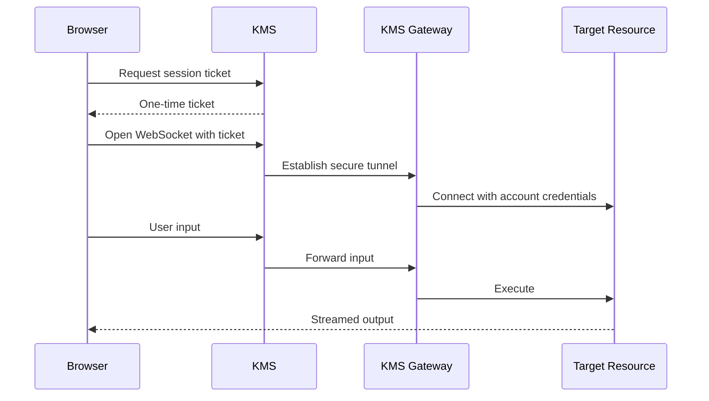

KMS PAM Web Access provides a browser-based portal for interacting with your infrastructure directly from your browser via the KMS dashboard — no client tools or CLI required.

<Info>
  Web Access currently supports **PostgreSQL** databases.
</Info>

## How It Works

When you open a web access session, KMS establishes a secure WebSocket connection that tunnels through an KMS Gateway to your target resource. All commands are executed server-side and streamed back to your browser in real time.

## Session Limits

| Setting | Value |
|---------|-------|
| **Max session duration** | 1 hour |
| **Idle timeout** | 5 minutes (resets on any input) |
| **Concurrent sessions** | 5 per user per project |

Sessions that exceed the idle timeout or max duration are automatically terminated.

## Supported Resources

<CardGroup cols={2}>
  <Card title="PostgreSQL" icon="database" href="/documentation/platform/pam/product-reference/web-access/postgresql">
    Interactive SQL terminal with psql-style output formatting.
  </Card>
</CardGroup>
